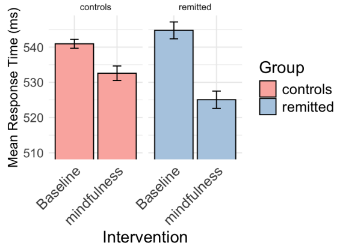

# Improving a figure

In Kaveh Rasouli's bachelor thesis, we found many bar plots which shared similar points of improvement. One example is the following figure:
```{r}
library(knitr)

```

The first potential improvement we can see is that the y-axis does not start at 0, which can be misleading with regards to the difference of impact between interventions. Also, the legend is redundant in my opinion, as the group labels are already displayed above each bar, making the color-coded legend unnecessary. Finally, the intervention types are labeled four times along the x-axis, and the use of diagonal text reduces readability.

```{r}
library(ggplot2)

df <- data.frame(
  group = rep(c("Controls", "Remitted"), each = 2),
  intervention = rep(c("Baseline", "Mindfulness"), 2),
  mean_RT = c(541, 532, 545, 525),
  SE = c(1.5, 2.5, 2.5, 2.5)
)

ggplot(df, aes(x=group, y=mean_RT, fill=intervention)) +
  geom_bar(stat="identity", position= position_dodge(width = 0.9), width=0.8) +
  geom_errorbar(aes(ymin = mean_RT - SE, ymax = mean_RT + SE),
                position = position_dodge(width = 0.9),
                width = 0.2) +
  labs(
    x = "Group",
    y = "Mean Response Time (ms)",
    fill = "Intervention:",
    title = "Mean Response Time: Baseline vs. Mindfulness"
  ) +
  theme_minimal() +
  scale_fill_manual(values = c("Baseline" = "lightblue", "Mindfulness" = "steelblue")) +
  theme(
    legend.position = "top"
  )
```
To improve this graph, we first ensure that the y-axis starts at zero to avoid exaggerating differences. Also, the group type is now placed on the x-axis (instead of the intervention type, which is now color coded), with horizontal labels directly below the corresponding bars. Furthermore, the intervention type is now represented using distinct colors that remain effective in both grayscale and for colorblind people. Finally, we made some minor changes to the layout of the barplot for aesthetics, such as putting the color code legend at the top and removing the black contour from the bars.

As a side note, we can also see that now that the y-axis of the graph starts at 0, the difference between interventions look a lot less impressive than initially.

# Making a shiny graph

To produce the shiny graph, I first thought about what data to display. Since the main focus of the dataset we chose are disaster frequencies, that seemed like the obvious data to visualize. I thought that a world map with color would be an appropriate and good looking visualization, using color mappings to visualize the difference between countries. Since some (large) countries had very large frequency values compared to all other countries, I decided to use a logarithmic scale. Since there were difference types of disaster indicators (flood, fire, etc.), I decided to add the possibility to filter by one or more of these values, summing up the frequencies. This allows users to both look for individual indicators but also easily group them together. Finally, I added a slider that allows users to select a range of years (this supports selecting single year) and again summing the frequencies. This allows to easily observe patterns over years. Additionally, since the scale is logarithmic and it is impossible to determine the absolute frequency by looking at the color, I added a tooltip that shows the name of the country and the corresponding frequency when hovering the country with the mouse. This allows to look at specific numeric details without cluttering the whole plot.

# Reflection

Shiny graphs are useful because they make it easy to explore data interactively. For example, instead of showing just one static graph, you can allow users to choose which variables to include or filter the data by year or type. This is really helpful when dealing with large or complex datasets like climate data, where different users might want to focus on different things. In our case, using a Shiny app helped visualize climate related disaster frequency trends per country over time, and users could select which type of disasters to include. On the downside, Shiny apps can be slower to load and need more effort to build and maintain compared to flat graphs. In general, it introduces the complexity of needing a running service instead of a simple static file. Additionally, for more inexperienced users, a simple plot with a clear message might be more effective, as the user might not know how to interact properly with the shiny graph and miss important details.

# Contributions

Ivan: Part 1

Sebastian: Part 2 and 3