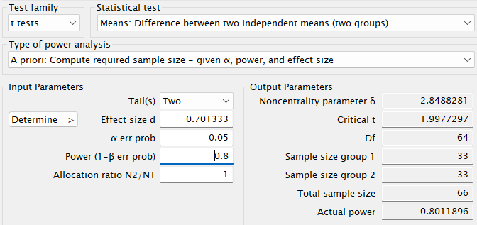
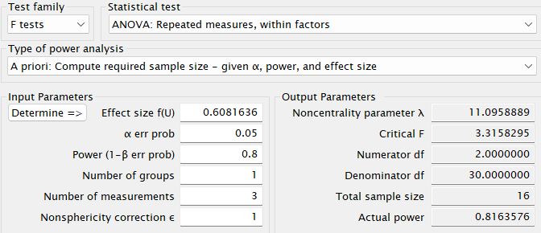
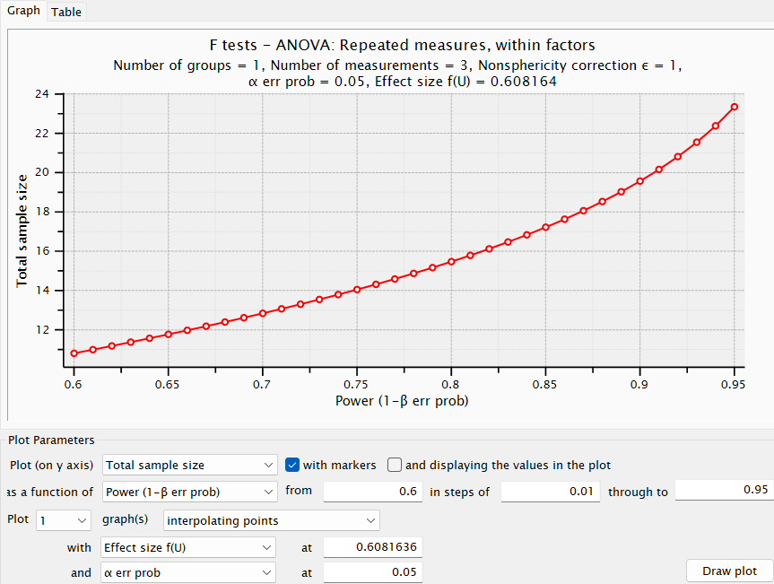

# Understanding p-values through simulation

```{r}
iq_test = function(n, M, nSims, sd, level=0.05) {
  
  p <- numeric(nSims)
  bars <- 20
  
  for(i in 1:nSims) {
    x <- rnorm(n = n, mean = M, sd = SD)
    z <- t.test(x, mu=100)
    p[i] <- z$p.value
  }

  (sum(p < level)/nSims)

  power <- pwr.t.test(d=(M-100)/SD, n=n,sig.level=level,type="one.sample",alternative="two.sided")$power

  op <- par(mar = c(5,7,4,4))
  hist(p, breaks=bars, xlab="P-values", ylab="number of p-values\n", axes=FALSE,
      main=paste("P-value Distribution with",round(power*100, digits=1),"% Power"),
      col="grey", xlim=c(0,1), ylim=c(0, 10000))
      axis(side=1, at=seq(0,1, 0.1), labels=seq(0,1,0.1))
      axis(side=2, at=seq(0,nSims, nSims/10), labels=seq(0,nSims, nSims/10), las=2)
  
  abline(h=nSims/bars, col="red", lty=3)

}
```

(a) 

```{r}
# Load pwr package to easily calculate the statistical power
if(!require(pwr)) { install.packages('pwr') }
library(pwr)
#Disable scientific notation (1.05e10)
options(scipen=999)
#Set number of simulations
nSims <- 100000 #number of simulated experiments
M<-106 #Mean IQ score in the sample (will be compared with 100 in a one-sample t-test)
n<-51 #set sample size
SD<-15 #SD of the simulated data

iq_test(n, M, nSims, SD)
```

As visible from the output and the histogram, the statistical power increases from 50 to 80%. The p-value distribution is more strongly skewed to the right and the bins above 0.1 contain very little samples (number of simulations). This aligns with the expectations that doubling the degrees of freedom will significantly increase the statistical power.

(b) 

```{r}
# Load pwr package to easily calculate the statistical power
if(!require(pwr)) { install.packages('pwr') }
library(pwr)
#Disable scientific notation (1.05e10)
options(scipen=999)
#Set number of simulations
nSims <- 100000 #number of simulated experiments
M<-100 #Mean IQ score in the sample (will be compared with 100 in a one-sample t-test)
n<-51 #set sample size
SD<-15 #SD of the simulated data

iq_test(n, M, nSims, SD)
```

When the sample mean does not differ from the null hypothesis, we observe a uniform distribution across all p-values at `alpha=0.05`. In other words, there is a 5% chance of observing a significant p-value when there is no true difference in the statistics. This is exactly what the type I error measures, so the outcome aligns with expectations. In general, when there is no difference, each p-value between 0 and 1 is equally likely.

(c) 

```{r}
# Load pwr package to easily calculate the statistical power
if(!require(pwr)) { install.packages('pwr') }
library(pwr)
#Disable scientific notation (1.05e10)
options(scipen=999)
#Set number of simulations
nSims <- 100000 #number of simulated experiments
M<-106 #Mean IQ score in the sample (will be compared with 100 in a one-sample t-test)
n<-51 #set sample size
SD<-15 #SD of the simulated data

iq_test(n, M, nSims, SD, 0.01)
```

When we change the p-value threshold from 0.05 to 0.01 and with a sample size of 51, we observe a statistical Power of 57.4%. Since the p-value threshold is lower, there is also a lower chance of observing a significant result when the true mean differs from the null hypothesis (as in our simulation) and this is reflected in a lower statistical power. However, interestingly, the statistical power with a sample size of 51 and p-value threshold of 0.01 (=57.4%) is still greater than the statistical power with sample size 26 and p-value 0.05 (=50%). In my opinion this highlights the importance of sample size and degrees of freedom for statistical power.

# Doing a power analysis

(a) Using the spreadsheet, we could find an effect size \(d_s\) of 0.701333 by filling in the sample sizes for the soft and loud conditions (20 and 22 respectively) as well as the t-value from the independent t-test (2.27). This effect size value indicates a medium to large difference in the outcome between the softer and louder voice conditions, in other words the voice volume has a substantial on the perceived distance.

(b) The following image shows the values from the assignment entered into G*power as well as the found effect size. From this, we can see that to achieve 80% statistical power for this experiment, we would need at least 66 total participants, with 33 in each group. 

```{r}
library(knitr)

```

(c) Changing the p-value from 0.05 to 0.005 in G*power (in the "\(\alpha\) err prob" box) yields a required total sample size of 114 (57 per group) to achieve 80% statistical power. This seems doable, but it will definitely require careful planning and an effective method for recruiting participants.

(d) Entering the values from the assignment into G*power for a within subjects ANOVA with one group and three measurements, and the effect size that has been computed using the partial eta squared of the ANOVA (= 0.27), we get the following results for a p-value of 0.05 and a statistical power of 80%:

```{r}
library(knitr)

```

From this, we can see that we would need at least 16 participants to replicate this experiment with 80% statistical power. The following graph shows the relationship between wanted statistical power and required sample size, as we can see the required sample size increases exponentially as the wanted statistical power increases.

```{r}
library(knitr)

```

(e) Using the spreadsheet, we find \(w^2_p = 0.253236\). Filling this in in G*power, we get an effect size of 0.5823325, and a required sample size of at least 17 to obtain 80% statistical power. As we can see, the required sample size can vary depending on the method used to measure effect size. This means we must be careful when deciding for a certain sample size, as different effect size measures can lead to different estimates.

# Doing a p-curve analysis

```{r}

p_values <- c(
  0.00000019,
  0.00135,
  0.00207,
  0.00052,
  0.0385,
  0.0238,
  0.0524,
  0.000000554,
  0.00349,
  0.0192,
  0.0884,
  0.459,
  0.00185
)

bins <- cut(p_values, breaks = seq(0, 0.05, 0.01), include.lowest = TRUE, right = FALSE)

counts <- table(bins)
total <- sum(counts)
percentages <- 100 * counts / total

labels <- c(".01", ".02", ".03", ".04", ".05")

plot(percentages,
     type = "o", col = "blue", lwd = 2, xaxt = "n", ylim = c(0, 100),
     xlab = "p-value", ylab = "Percentage of test results",
     main = "P-Curve (Observed Significant p-values)")
axis(1, at = 1:5, labels = labels)

text(1:5, percentages + 5, paste0(round(percentages), "%"), col = "blue")


abline(h = 20, col = "red", lty = 2)

# Legend
legend("topright",
       legend = c("Observed p-curve", "Null of no effect"),
       col = c("blue", "red", "darkgreen"),
       lty = c(1, 2, 3),
       bty = "n")


```


The meta-analysis aims to investigate whether there is evidence supporting the effectiveness of metacognitive training for psychosis (MCT) in reducing symptoms associated with schizophrenia, including delusions, hallucinations, and both positive and negative symptom clusters Meinhart et al., 2025.

To conduct the p-curve analysis, we first extracted the p-values reported for each of the analyzed studies, including only those labeled as "positive symptoms", "hallucinations", or "delusions". These categories were grouped under the category of positive psychotic symptoms, consistent with psychiatric classifications, and provided a sufficient number of data points for meaningful statistical analysis.

We then plotted these p-values by binning them into five equal-width intervals ranging from 0.01 to 0.05. The x-axis represents these p-value ranges, while the y-axis shows the percentage of p-values falling within each bin. Additionally, reference lines were plotted to reflect the expected distributions under the null hypothesis of no effect and under the assumption of 33% statistical power.

The resulting plot reveals a right-skewed distribution, with the majority of p-values concentrated in the first bin (< 0.01). The remaining p-values appear evenly distributed across the middle bins, while the final bin (0.04–0.05) contains no values.

Taken together, the p-curve analysis suggests that the significant findings related to positive symptoms in the MCT literature are unlikely to be due to random chance or selective reporting. Instead, the observed distribution aligns with what would be expected if MCT has a genuine effect on reducing positive psychotic symptoms. This is consistent with the findings reported in Meinhart et al. (2025).
